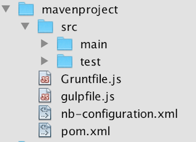
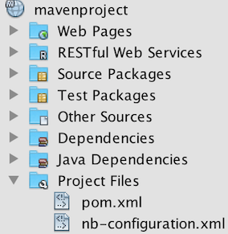
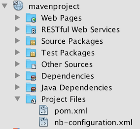

# FullMavenProjectFilesNode

Replacement for Project Files node in Maven logical view in NetBeans.

Given a Files window with this content:

...before, the Projects window would look like this:

...while after installing the plugin, you'll have all source files in the root node available in the Projects window:

The benefit is that now you have everything available in the Projects window and you don't need to switch to the Files window.

Note: After installing the plugin, you'll need to do a restart, otherwise you'll have two Project Files nodes, i.e., after the restart the old one will be removed.
